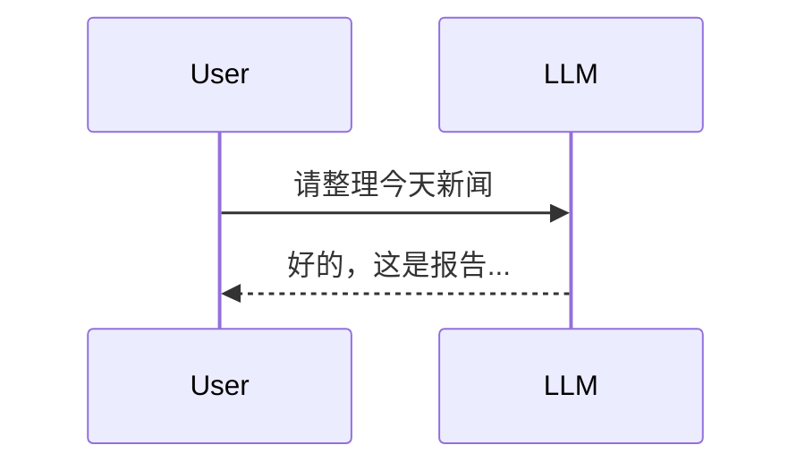
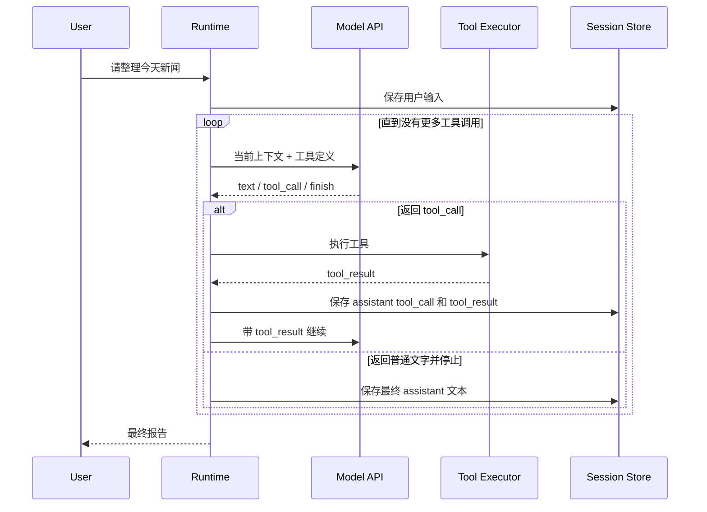
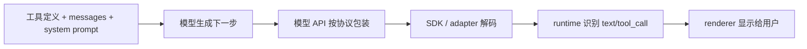
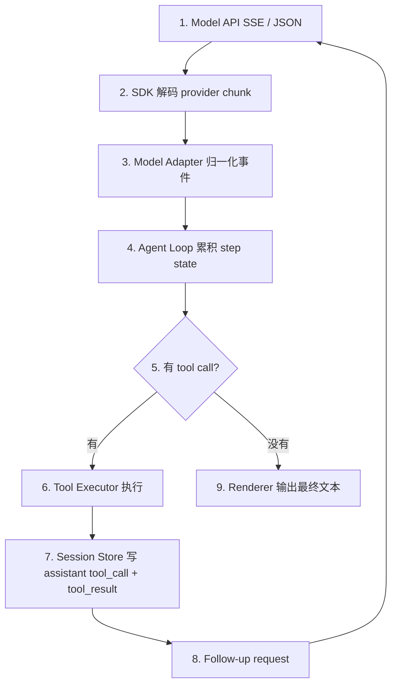
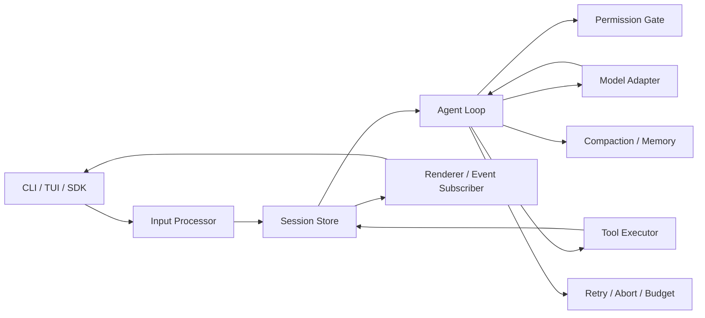

# Agentic Tool Runtime 学习手册

从“一问一答聊天模型”到“能持续操纵环境的 agent”

## 0. 这份手册回答什么问题

你前面的疑问其实落在同一条主线上：

1. 聊天型 LLM 原本只会回答用户，为什么 agentic tool 能不等待用户反馈而持续运行？
2. Runtime 如何知道 LLM 返回的是工具调用、命令，还是普通文字？
3. LLM 在 agentic tool 里是不是会被系统提示词约束，只输出 `{ type: "text", text: "hello world!" }` 这种结构，而不是裸文本？
4. 从模型 API 服务端返回，到用户在屏幕上看到文字，中间到底经历了哪些真实步骤？
5. Claude API 和 OpenAI-compatible API 在 tool calling 上是不是同一套做法？
6. Claude Code、OpenCode、KiloCode 这些主流工具在代码架构上如何实现这条工作流？

这份手册的核心结论是：

> Agentic tool 不是让 LLM 自己变成长期运行程序，而是把 LLM 包进一个由 runtime 控制的状态机。LLM 每次只决定下一步；runtime 负责识别结构化 tool call、执行工具、保存结果、再次调用模型，并在停止条件满足后才把最终结果交给用户。

更精确地说，真正“持续行动”的不是模型本身，而是外层 agent runtime。

---

## 1. 最小概念模型

传统聊天：



Agentic runtime：



这条链路里，LLM 没有“自己等待工具返回”的能力。它只是通过模型 API 表达“我想调用某个工具”。Runtime 看到这个结构后，替它执行工具，再把工具结果作为下一轮输入喂回模型。

---

## 2. 不是“裸文本魔法”，而是协议层结构

主流 agentic tool 都不是靠解析自然语言来猜命令。

这句普通文本本身不会自动执行：

```text
我要运行 npm test
```

真正触发执行的是模型 API 返回的结构化字段。例如 Claude 风格的 assistant content block：

```ts
type ClaudeAssistantBlock =
  | { type: "text"; text: string }
  | {
      type: "tool_use"
      id: string
      name: string
      input: Record<string, unknown>
    }
```

OpenAI Chat Completions 风格则不是 `content` array，而是 assistant message 上的 `tool_calls`：

```ts
type OpenAIChatToolCall = {
  id: string
  type: "function"
  function: {
    name: string
    arguments: string // JSON-encoded string
  }
}
```

OpenAI Responses API 风格又是 `output` item：

```ts
type OpenAIResponseOutputItem =
  | {
      type: "message"
      role: "assistant"
      content: Array<{ type: "output_text"; text: string }>
    }
  | {
      type: "function_call"
      id: string
      call_id: string
      name: string
      arguments: string // JSON-encoded string
    }
```

Runtime 的判断逻辑通常很朴素：

```ts
for await (const event of modelStream) {
  if (event.type === "text-delta") {
    appendAssistantText(event.text)
  }

  if (event.type === "tool-call") {
    pendingToolCalls.push(event)
  }
}

if (pendingToolCalls.length > 0) {
  const results = await executeTools(pendingToolCalls)
  appendToolResultsToConversation(results)
  continueLoop()
} else {
  finishTurn()
}
```

### 2.1 你的关键疑问：LLM 是否被约束成只输出 `{ type: "text" }`

答案要分层看。

从 HTTP API 使用者角度看，你几乎不会收到裸的：

```text
hello world!
```

你会收到 JSON response、SSE event、SDK object 或 runtime event。也就是说，服务端返回一定有协议包裹。

但这不等于“模型本体被系统提示词要求逐字输出 `{ type: "text" }`”。更可靠的理解是：



协议层有三种常见情况：

| API 表面 | 普通文本在哪里 | 工具调用在哪里 |
|---|---|---|
| Claude Messages | `content[].type === "text"` | `content[].type === "tool_use"` |
| OpenAI Chat Completions | `choices[].message.content`，通常是字符串 | `choices[].message.tool_calls[]` |
| OpenAI Responses | `output[]` 里的 message/content item | `output[]` 里的 `type: "function_call"` |

所以，`{ type: "text", text: "hello world!" }` 是某些 API 或 runtime 的内容块表示，不是所有 OpenAI-compatible API 的统一文本形态。

### 2.2 系统提示词、工具定义、API 协议分别负责什么

系统提示词负责影响模型行为，例如“需要调查时先用工具”。

工具定义负责告诉模型可用工具、名称、描述和 JSON schema。

API 协议负责把模型的选择呈现成稳定字段，例如 Claude 的 `tool_use`、OpenAI Chat Completions 的 `tool_calls`、OpenAI Responses 的 `function_call`。

官方文档里有一个很重要的细节：

| 厂商 | 文档说法的工程含义 |
|---|---|
| Anthropic Claude | 传入 `tools` 时，API 会自动包含一个启用 tool use 的特殊系统提示；client tool 会以 `stop_reason: "tool_use"` 和 `tool_use` block 返回。 |
| OpenAI | Function definitions 会作为工具选择上下文传给模型；模型返回 Chat Completions `tool_calls` 或 Responses `function_call` 后，应用程序必须执行并回填结果。 |

这说明 agentic tool 不是只靠“提示词叫模型输出 JSON”。它依赖的是：

1. 模型训练过这种工具调用行为。
2. API 接受工具 schema。
3. API 返回结构化 tool call。
4. Runtime 执行工具并把结果回填。
5. 外层 loop 决定是否继续。

---

## 3. 从模型 API 到屏幕：输出流的真实演化

下面把“模型服务端返回”到“用户屏幕显示”拆成可观察的层。



这条链路里有两个并行事实：

1. UI 可以边收 `text_delta` 边显示进度。
2. Runtime 不会因为屏幕显示了文字就停止，它要等这一轮模型输出结束，确认是否有 tool call 或停止原因。

### 3.1 Claude streaming 的真实事件形态

Claude Messages 开启 `stream: true` 后，官方文档说明使用 SSE，事件流大致是：

```text
event: message_start
data: {"type":"message_start","message":{"role":"assistant","content":[],"stop_reason":null}}

event: content_block_start
data: {"type":"content_block_start","index":0,"content_block":{"type":"text","text":""}}

event: content_block_delta
data: {"type":"content_block_delta","index":0,"delta":{"type":"text_delta","text":"Okay"}}

event: content_block_stop
data: {"type":"content_block_stop","index":0}

event: content_block_start
data: {"type":"content_block_start","index":1,"content_block":{"type":"tool_use","id":"toolu_01...","name":"get_weather","input":{}}}

event: content_block_delta
data: {"type":"content_block_delta","index":1,"delta":{"type":"input_json_delta","partial_json":"{\"location\":\"San Francisco, CA\"}"}}

event: content_block_stop
data: {"type":"content_block_stop","index":1}

event: message_delta
data: {"type":"message_delta","delta":{"stop_reason":"tool_use","stop_sequence":null}}

event: message_stop
data: {"type":"message_stop"}
```

Runtime 对 Claude stream 的处理重点：

```ts
function onClaudeEvent(event: ClaudeStreamEvent, state: StepState) {
  if (event.type === "content_block_start") {
    state.blocks[event.index] = event.content_block
  }

  if (event.type === "content_block_delta") {
    const block = state.blocks[event.index]

    if (event.delta.type === "text_delta" && block.type === "text") {
      block.text += event.delta.text
      renderer.write(event.delta.text)
    }

    if (event.delta.type === "input_json_delta" && block.type === "tool_use") {
      state.partialToolJson[event.index] += event.delta.partial_json
    }
  }

  if (event.type === "content_block_stop") {
    const block = state.blocks[event.index]
    if (block.type === "tool_use") {
      block.input = JSON.parse(state.partialToolJson[event.index])
      state.toolCalls.push(block)
    }
  }

  if (event.type === "message_delta") {
    state.stopReason = event.delta.stop_reason
  }
}
```

这里有一个非常实际的点：Claude 的 tool input 在流式阶段是 `partial_json` 字符串片段，最终 `tool_use.input` 才是对象。Runtime 通常会等 `content_block_stop` 后再安全解析和执行。

### 3.2 Claude tool result 如何回填

非流式 Claude assistant 响应可能长这样：

```json
{
  "type": "message",
  "role": "assistant",
  "content": [
    {
      "type": "text",
      "text": "我先查一下天气。"
    },
    {
      "type": "tool_use",
      "id": "toolu_01ABC",
      "name": "get_weather",
      "input": {
        "location": "Taipei"
      }
    }
  ],
  "stop_reason": "tool_use"
}
```

Client tool 由你的 runtime 执行，然后必须用 `tool_use_id` 回填：

```json
{
  "role": "user",
  "content": [
    {
      "type": "tool_result",
      "tool_use_id": "toolu_01ABC",
      "content": "Taipei: 29C, cloudy"
    }
  ]
}
```

Anthropic 文档还要求 tool result block 必须紧跟对应的 assistant tool use message；在同一个 user content array 里，`tool_result` 必须放在任何普通 text 之前。

### 3.3 OpenAI Chat Completions 的真实事件形态

OpenAI Chat Completions 的 function tool schema 典型请求：

```json
{
  "model": "gpt-4.1",
  "messages": [
    { "role": "user", "content": "What's the weather like in Paris today?" }
  ],
  "tools": [
    {
      "type": "function",
      "function": {
        "name": "get_weather",
        "description": "Get current temperature for a given location.",
        "parameters": {
          "type": "object",
          "properties": {
            "location": { "type": "string" }
          },
          "required": ["location"],
          "additionalProperties": false
        },
        "strict": true
      }
    }
  ]
}
```

字段约束里有几个适合 runtime 作者记住的点：

1. `tools[].type` 对 function tool 固定为 `"function"`。
2. `function.name` 是必填字段，官方约束为最长 64 个字符，只允许字母、数字、下划线和连字符。
3. `function.parameters` 是 JSON Schema 形态。
4. `strict: true` 表示启用严格 schema 遵循，但第三方 OpenAI-compatible 服务商未必支持。

非流式 tool call 响应的核心形态：

```json
{
  "choices": [
    {
      "message": {
        "role": "assistant",
        "content": null,
        "tool_calls": [
          {
            "id": "call_123",
            "type": "function",
            "function": {
              "name": "get_weather",
              "arguments": "{\"location\":\"Paris, France\"}"
            }
          }
        ]
      },
      "finish_reason": "tool_calls"
    }
  ]
}
```

OpenAI 的一个关键差异是：`function.arguments` 是 JSON-encoded string，不是已经 parse 好的 object。Runtime 必须自己 `JSON.parse`，并且要做 schema validation 和错误处理。

工具执行后，Chat Completions 用 `role: "tool"` 回填：

```json
{
  "role": "tool",
  "tool_call_id": "call_123",
  "content": "{\"temperature\":\"18C\",\"condition\":\"rain\"}"
}
```

### 3.4 OpenAI Chat Completions streaming 如何拼 tool call

OpenAI streaming 使用 chunk + `choices[].delta`。普通文本会在 `delta.content` 里逐块出现；工具调用则在 `delta.tool_calls` 里逐块出现。

典型 tool call delta：

```json
{
  "choices": [
    {
      "delta": {
        "tool_calls": [
          {
            "index": 0,
            "id": "call_DdmO9pD3xa9XTPNJ32zg2hcA",
            "type": "function",
            "function": {
              "name": "get_weather",
              "arguments": ""
            }
          }
        ]
      }
    }
  ]
}
```

后续 chunk 可能只继续补 `arguments`：

```json
{
  "choices": [
    {
      "delta": {
        "tool_calls": [
          {
            "index": 0,
            "id": null,
            "type": null,
            "function": {
              "name": null,
              "arguments": "{\"location\":\"Paris"
            }
          }
        ]
      }
    }
  ]
}
```

Runtime 要按 `index` 聚合：

```ts
function accumulateOpenAIChatChunk(chunk: ChatChunk, state: StepState) {
  const delta = chunk.choices[0]?.delta

  if (delta?.content) {
    state.text += delta.content
    renderer.write(delta.content)
  }

  for (const callDelta of delta?.tool_calls ?? []) {
    const index = callDelta.index
    const call = state.openAIToolCalls[index] ??= {
      id: "",
      type: "function",
      function: { name: "", arguments: "" },
    }

    if (callDelta.id) call.id = callDelta.id
    if (callDelta.type) call.type = callDelta.type
    if (callDelta.function?.name) call.function.name = callDelta.function.name
    if (callDelta.function?.arguments) {
      call.function.arguments += callDelta.function.arguments
    }
  }

  if (chunk.choices[0]?.finish_reason === "tool_calls") {
    state.finishReason = "tool_calls"
  }
}
```

### 3.5 OpenAI Responses API 的对应做法

Responses API 的工具定义比 Chat Completions 更平铺，不再把函数信息包在 `function` 对象里：

```json
{
  "type": "function",
  "name": "get_weather",
  "description": "Get current weather for a city.",
  "parameters": {
    "type": "object",
    "properties": {
      "location": { "type": "string" }
    },
    "required": ["location"],
    "additionalProperties": false
  },
  "strict": true
}
```

Responses API 把 tool call 放在 `response.output` item 里：

```json
[
  {
    "id": "fc_12345xyz",
    "call_id": "call_12345xyz",
    "type": "function_call",
    "name": "get_weather",
    "arguments": "{\"location\":\"Paris, France\"}",
    "status": "completed"
  }
]
```

工具结果用 `function_call_output` 回填：

```json
{
  "type": "function_call_output",
  "call_id": "call_12345xyz",
  "output": "Paris: 18C, rain"
}
```

所以 Claude 和 OpenAI 的原则相同，但字段不相同：

| 动作 | Claude Messages | OpenAI Chat Completions | OpenAI Responses |
|---|---|---|---|
| 普通文本 | `content[].type = "text"` | `message.content` | `output[].type = "message"` / text content |
| 工具调用 | `content[].type = "tool_use"` | `message.tool_calls[]` | `output[].type = "function_call"` |
| 工具参数 | `input` object | `function.arguments` JSON string | `arguments` JSON string |
| 工具结果 | user content `tool_result` | message `role: "tool"` | input item `function_call_output` |
| 配对字段 | `tool_use_id` | `tool_call_id` | `call_id` |
| 流式参数 | `input_json_delta.partial_json` | `delta.tool_calls[].function.arguments` | Responses stream event，需按 output item 聚合 |

### 3.6 OpenAI-compatible 是否“相同”

工程上要小心：OpenAI-compatible 通常表示接口路径和大部分 request/response 字段尽量兼容 OpenAI，但不保证所有服务商都完整支持以下能力：

1. `tools` 参数。
2. `tool_choice` 参数。
3. `parallel_tool_calls`。
4. Streaming `delta.tool_calls`。
5. `finish_reason: "tool_calls"`。
6. `role: "tool"` + `tool_call_id` 回填。
7. Strict structured outputs 或 strict function schema。
8. Responses API 的 `function_call` / `function_call_output`。
9. 多工具并行和数组型工具输出。

所以实现 agent runtime 时，provider adapter 应该明确做 capability probing：

```ts
type ProviderCapabilities = {
  supportsTools: boolean
  supportsStreamingToolCalls: boolean
  supportsParallelToolCalls: boolean
  supportsStrictFunctionSchema: boolean
  toolArgumentsAreJsonString: boolean
}
```

这也是 OpenCode、KiloCode 这类工具会引入 model adapter / provider abstraction 的原因：agent loop 想要统一事件，但不同 provider 的原始协议不一样。

---

## 4. Slash command、shell command、tool call 的边界

这里有一个容易混淆的点。

`/commit`、`/review`、`/loop` 这类 slash command 通常是用户输入阶段由 CLI 或 prompt processor 解析的。

模型想执行 shell 命令时，通常不会输出裸文本：

```text
npm test
```

它会输出结构化工具调用。Claude 风格：

```json
{
  "type": "tool_use",
  "id": "toolu_01ABC",
  "name": "Bash",
  "input": {
    "command": "npm test"
  }
}
```

OpenAI Chat Completions 风格：

```json
{
  "id": "call_123",
  "type": "function",
  "function": {
    "name": "run_shell_command",
    "arguments": "{\"command\":\"npm test\"}"
  }
}
```

Runtime 看到 `Bash` 或 `run_shell_command`，再进入权限检查、沙箱执行、结果回填。普通文本中的 `npm test` 不应该被自动执行。

---

## 5. Agentic Runtime 的标准模块

一个成熟 agentic runtime 通常至少有这些模块：



| 模块 | 职责 |
|---|---|
| Input Processor | 解析用户输入、slash command、附件、模式切换 |
| Session Store | 保存用户消息、assistant 消息、tool call、tool result、状态 |
| Agent Loop | 判断继续还是停止，是 runtime 的心脏 |
| Model Adapter | 调用模型 API，把响应转成统一事件或 content block |
| Tool Executor | 校验输入、检查权限、执行工具、格式化结果 |
| Permission Gate | 控制危险操作是否允许执行 |
| Compaction / Memory | 控制上下文长度，并注入长期记忆 |
| Renderer | 只负责把事件展示给用户，不决定 agent 是否继续 |

最关键的分层原则是：UI 不是 loop，renderer 也不是 loop。屏幕显示了文字，并不代表 agent turn 结束。Agent turn 是否结束，要由 runtime 根据 tool calls、finish reason、step budget、abort signal、permission 状态共同决定。

---

## 6. Claude Code 的实现方式

参考仓库：<https://github.com/tanbiralam/claude-code>

关键文件：

| 文件 | 作用 |
|---|---|
| [`src/QueryEngine.ts`](https://github.com/tanbiralam/claude-code/blob/main/src/QueryEngine.ts) | 一次用户 turn 的包装器，构建系统提示、处理用户输入、持久化 transcript |
| [`src/query.ts`](https://github.com/tanbiralam/claude-code/blob/main/src/query.ts) | 真正的 agent loop，循环调用模型、收集工具调用、执行工具、判断继续 |
| [`src/services/tools/toolOrchestration.ts`](https://github.com/tanbiralam/claude-code/blob/main/src/services/tools/toolOrchestration.ts) | 工具调用调度，区分可并发工具和必须串行的工具 |
| [`src/services/tools/toolExecution.ts`](https://github.com/tanbiralam/claude-code/blob/main/src/services/tools/toolExecution.ts) | 单个工具调用的权限、执行、错误处理、结果包装 |
| [`src/tools/AgentTool/AgentTool.tsx`](https://github.com/tanbiralam/claude-code/blob/main/src/tools/AgentTool/AgentTool.tsx) | 子代理工具，将子代理当作一种 tool 调用 |
| [`src/utils/forkedAgent.ts`](https://github.com/tanbiralam/claude-code/blob/main/src/utils/forkedAgent.ts) | forked agent 的隔离上下文、缓存、安全参数和用量追踪 |
| [`src/entrypoints/mcp.ts`](https://github.com/tanbiralam/claude-code/blob/main/src/entrypoints/mcp.ts) | 把内建工具暴露成 MCP server |

Claude Code 的 loop 可以抽象成：

```ts
async function* queryLoop(state: QueryState) {
  while (true) {
    const response = await callClaude({
      messages: state.messages,
      tools: state.tools,
      systemPrompt: state.systemPrompt,
    })

    yield response.assistantMessage

    const toolUses = response.content.filter(
      (block) => block.type === "tool_use",
    )

    if (toolUses.length === 0) {
      return { reason: "done" }
    }

    for await (const update of runTools(
      toolUses,
      response.assistantMessages,
      state.canUseTool,
      state.toolUseContext,
    )) {
      if (update.message) {
        yield update.message
        state.messages.push(update.message)
      }

      state.toolUseContext = update.newContext
    }
  }
}
```

它的重点：

1. `query.ts` 里有跨迭代的 mutable `State`，包括 messages、tool context、compact 状态、retry counter、turn count。
2. 每次模型输出 assistant message 后，runtime 会检查 content block 里有没有 `tool_use`。
3. 有 `tool_use` 就进入 `runTools(...)`，工具结果会被包装成 `tool_result` user message。
4. `tool_result` 被塞回 message history，然后 loop 继续。
5. 没有 `tool_use` 才进入 final result。

Claude Code 的风格可以称为：

> 单进程 async generator 状态机。

它和 Claude API 的 content block 结构贴得很近，所以特别适合理解 agentic loop 的本质。

---

## 7. OpenCode 的实现方式

参考仓库：<https://github.com/anomalyco/opencode>

关键文件：

| 文件 | 作用 |
|---|---|
| [`packages/opencode/src/cli/cmd/run.ts`](https://github.com/anomalyco/opencode/blob/dev/packages/opencode/src/cli/cmd/run.ts) | CLI 入口，创建或恢复 session，订阅事件并输出 |
| [`packages/opencode/src/session/prompt.ts`](https://github.com/anomalyco/opencode/blob/dev/packages/opencode/src/session/prompt.ts) | 会话 turn 的编排，解析 prompt、选择 agent/model、解析工具 |
| [`packages/opencode/src/session/llm.ts`](https://github.com/anomalyco/opencode/blob/dev/packages/opencode/src/session/llm.ts) | 模型适配器，调用 AI SDK 或 native LLM runtime |
| [`packages/opencode/src/session/processor.ts`](https://github.com/anomalyco/opencode/blob/dev/packages/opencode/src/session/processor.ts) | 事件 reducer，处理 text、tool、reasoning、finish-step、retry |
| [`packages/core/src/session/runner/llm.ts`](https://github.com/anomalyco/opencode/blob/dev/packages/core/src/session/runner/llm.ts) | core runner，按 step 推进 session |
| [`packages/core/src/session/run-coordinator.ts`](https://github.com/anomalyco/opencode/blob/dev/packages/core/src/session/run-coordinator.ts) | 确保同一 session 只有一个 runner 正在推进 |

OpenCode 的核心更像事件驱动系统：

```ts
async function process(stream: AsyncIterable<LLMEvent>) {
  for await (const event of stream) {
    switch (event.type) {
      case "text-delta":
        await session.updatePart(appendText(event.text))
        break

      case "tool-call":
        await session.updatePart(markToolRunning(event))
        executeTool(event)
        break

      case "tool-result":
        await session.updatePart(markToolCompleted(event))
        break

      case "finish-step":
        return decideNextStep()
    }
  }
}
```

它的重点：

1. CLI 不直接决定 agent 是否继续，它只是 session event 的消费者。
2. `llm.ts` 把 provider stream 转换成统一事件，例如 `tool-call`、`tool-result`、`text-delta`、`finish-step`。
3. `processor.ts` 把事件写入持久化 session state。
4. Runner 根据持久化状态决定继续、compact、retry 或 idle。
5. `run-coordinator.ts` 负责避免同一个 session 被多个 runner 同时推进。

OpenCode 的风格可以称为：

> Durable session runner + event reducer。

这类设计更适合多客户端、可恢复、可远程同步的 agent。

---

## 8. KiloCode 的实现方式

参考仓库：<https://github.com/Kilo-Org/kilocode>

关键文件：

| 文件 | 作用 |
|---|---|
| [`packages/opencode/src/cli/cmd/run.ts`](https://github.com/Kilo-Org/kilocode/blob/main/packages/opencode/src/cli/cmd/run.ts) | Kilo CLI 入口，继承 OpenCode 的 run 模式并扩展 cloud/session 能力 |
| [`packages/llm/src/tool-runtime.ts`](https://github.com/Kilo-Org/kilocode/blob/main/packages/llm/src/tool-runtime.ts) | 最清晰的工具循环抽象：收集 tool-call，执行工具，构造 follow-up request |
| [`packages/opencode/src/kilo-sessions/kilo-sessions.ts`](https://github.com/Kilo-Org/kilocode/blob/main/packages/opencode/src/kilo-sessions/kilo-sessions.ts) | Kilo session ingest、remote status、共享和同步 |
| [`packages/opencode/src/kilocode/plan-followup.ts`](https://github.com/Kilo-Org/kilocode/blob/main/packages/opencode/src/kilocode/plan-followup.ts) | 计划到执行的 handover 工作流 |

`tool-runtime.ts` 可以视为最小 agent loop 教材：

```ts
const loop = (request: LLMRequest, step: number) => {
  const state = {
    assistantContent: [],
    toolCalls: [],
    finishReason: undefined,
  }

  const modelStream = stream(request).tap((event) => {
    accumulate(state, event)
  })

  const continuation = async () => {
    if (state.finishReason !== "tool-calls") return
    if (state.toolCalls.length === 0) return

    const dispatched = await executeAll(state.toolCalls)
    emitToolResultEvents(dispatched)

    if (stopWhen({ step, request })) return

    return loop(
      followUpRequest(request, state, dispatched),
      step + 1,
    )
  }

  return concat(modelStream, continuation)
}
```

里面最关键的两个函数是：

```ts
function accumulate(state: StepState, event: LLMEvent) {
  if (event.type === "text-delta") {
    appendStreamingText(state, "text", event.text, undefined)
  }

  if (event.type === "tool-call") {
    state.assistantContent.push(ToolCallPart.make(event))
    if (!event.providerExecuted) {
      state.toolCalls.push(event)
    }
  }

  if (event.type === "request-finish") {
    state.finishReason = event.reason
  }
}
```

以及：

```ts
function followUpRequest(request, state, dispatched) {
  return LLMRequest.update(request, {
    messages: [
      ...request.messages,
      Message.assistant(state.assistantContent),
      ...dispatched.map(([call, result]) =>
        Message.tool({ id: call.id, name: call.name, result }),
      ),
    ],
  })
}
```

这就是 agentic runtime 的精华：

1. 普通文字进入 `assistantContent`。
2. `tool-call` 进入 `toolCalls`。
3. Request finish reason 是 `tool-calls` 时，runtime 执行工具。
4. 工具结果被转成 `Message.tool(...)`。
5. 新 request 带着 assistant 工具调用和 tool result 继续。

KiloCode 的风格可以称为：

> 可复用 LLM tool runtime + OpenCode 式 session 系统。

---

## 9. 三者对照表

| 维度 | Claude Code | OpenCode | KiloCode |
|---|---|---|---|
| 主循环形态 | `query.ts` 的 async generator `while (true)` | durable session runner + processor | OpenCode 风格 + 独立 `ToolRuntime.stream` |
| 工具识别方式 | Anthropic `content.type === "tool_use"` | LLM event `event.type === "tool-call"` | LLM event `event.type === "tool-call"` |
| 普通文字处理 | yield assistant text，继续观察是否有 tool_use | `text-delta` 写入 part | `text-delta` 累积到 assistant content |
| 工具执行 | `runTools(...)` + `runToolUse(...)` | processor / runner / tool materialization | `dispatch(...)` + `followUpRequest(...)` |
| Provider 适配 | 贴近 Claude Messages content block | 抽象成 session event | 抽象成 LLMEvent + ToolRuntime |
| 持久化 | JSONL transcript / session storage | session DB / events / parts | session ingest / remote sync / OpenCode session |
| 并发控制 | 工具按 concurrency safe 分批 | run coordinator / session status | session runner + Kilo remote/session status |
| 子代理 | `AgentTool` / forked agent / in-process teammate | session/task 模型 | plan followup / session continuation |
| 适合学习的点 | 最直观状态机 | 可恢复事件系统 | 最小 tool runtime 抽象 |

---

## 10. 自己实现一个最小 Agent Runtime

下面是一份教学版 TypeScript 伪代码。它不依赖具体模型厂商，但包含完整 agentic loop 的骨架。

```ts
type Message =
  | { role: "user"; content: string }
  | { role: "assistant"; content: AssistantBlock[] }
  | { role: "tool"; toolCallId: string; name: string; result: unknown }

type AssistantBlock =
  | { type: "text"; text: string }
  | { type: "tool_call"; id: string; name: string; input: unknown }

type Tool = {
  name: string
  schema: unknown
  execute(input: unknown, ctx: ToolContext): Promise<unknown>
}

type RuntimeState = {
  messages: Message[]
  tools: Record<string, Tool>
  maxSteps: number
}
```

主循环：

```ts
async function runAgentTurn(userInput: string, state: RuntimeState) {
  state.messages.push({ role: "user", content: userInput })
  await persist(state.messages)

  for (let step = 0; step < state.maxSteps; step++) {
    const assistant = await callModel({
      messages: state.messages,
      tools: Object.values(state.tools).map(toToolDefinition),
    })

    state.messages.push({
      role: "assistant",
      content: assistant.content,
    })
    await persist(state.messages)

    const toolCalls = assistant.content.filter(
      (block): block is Extract<AssistantBlock, { type: "tool_call" }> =>
        block.type === "tool_call",
    )

    if (toolCalls.length === 0) {
      return extractFinalText(assistant.content)
    }

    for (const call of toolCalls) {
      const tool = state.tools[call.name]
      if (!tool) {
        state.messages.push({
          role: "tool",
          toolCallId: call.id,
          name: call.name,
          result: { error: `Unknown tool: ${call.name}` },
        })
        continue
      }

      const allowed = await checkPermission(call)
      if (!allowed) {
        state.messages.push({
          role: "tool",
          toolCallId: call.id,
          name: call.name,
          result: { error: "Permission denied" },
        })
        continue
      }

      const result = await tool.execute(call.input, { messages: state.messages })
      state.messages.push({
        role: "tool",
        toolCallId: call.id,
        name: call.name,
        result,
      })
      await persist(state.messages)
    }
  }

  throw new Error("Max steps reached")
}
```

这个最小版本已经具备 agentic 能力：

1. 用户只输入一次。
2. 模型可以返回工具调用。
3. Runtime 执行工具。
4. 工具结果回填给模型。
5. 模型继续下一步。
6. 没有工具调用时才返回最终文本。

---

## 11. Provider adapter：把 Claude 和 OpenAI 统一成内部事件

真实项目最好不要让 agent loop 直接依赖 Claude 或 OpenAI 的原始字段。可以先归一化成内部事件。

```ts
type RuntimeEvent =
  | { type: "text-delta"; text: string }
  | { type: "tool-call"; id: string; name: string; input: unknown }
  | { type: "tool-result"; id: string; name: string; result: unknown }
  | { type: "request-finish"; reason: "stop" | "tool-calls" | "error" }
```

Claude adapter：

```ts
function fromClaudeBlock(block: ClaudeAssistantBlock): RuntimeEvent[] {
  if (block.type === "text") {
    return [{ type: "text-delta", text: block.text }]
  }

  if (block.type === "tool_use") {
    return [{
      type: "tool-call",
      id: block.id,
      name: block.name,
      input: block.input,
    }]
  }

  return []
}
```

OpenAI Chat Completions adapter：

```ts
function fromOpenAIMessage(message: OpenAIChatMessage): RuntimeEvent[] {
  const events: RuntimeEvent[] = []

  if (message.content) {
    events.push({ type: "text-delta", text: message.content })
  }

  for (const call of message.tool_calls ?? []) {
    events.push({
      type: "tool-call",
      id: call.id,
      name: call.function.name,
      input: JSON.parse(call.function.arguments),
    })
  }

  return events
}
```

这样上层 agent loop 只关心 `RuntimeEvent`，不关心 provider 原始协议。这就是 OpenCode / KiloCode 风格的核心收益。

---

## 12. 设计时最容易踩的坑

### 12.1 把工具调用当成普通文本解析

不要设计成：

```ts
if (assistantText.includes("RUN:")) {
  execute(...)
}
```

这很脆弱，也很危险。应该使用模型 API 的 structured tool calling。

### 12.2 误以为 `{ type: "text" }` 是所有 API 的统一格式

Claude 是 content block；OpenAI Chat Completions 的普通文本通常是 `message.content` 字符串；OpenAI Responses 才更像 output item。不要把某个 SDK 的内部事件格式误认为 provider 原生协议。

### 12.3 Streaming tool arguments 没有完整聚合

Claude 的 `input_json_delta.partial_json` 和 OpenAI 的 `delta.tool_calls[].function.arguments` 都可能是碎片。不要在参数还没完整时执行工具。

### 12.4 没有持久化中间状态

如果只在最后保存结果，中途崩溃就无法 resume。成熟工具都会尽量保存用户输入、assistant text、tool call、tool result、permission、retry、abort 状态。

### 12.5 UI 直接驱动 agent

UI 应该只是事件观察者。否则 CLI、TUI、SDK、远程 session 都会互相纠缠。

### 12.6 没有停止条件

至少需要没有 tool call 时停止、max steps / max turns、token budget、permission blocked、abort signal、retry exhausted。

### 12.7 工具结果没有配对 tool call id

模型 API 通常要求：

```text
assistant tool_call id=abc
tool_result tool_call_id=abc
```

如果缺失或配错，下一轮请求可能直接报错。

---

## 13. 建议的学习顺序

如果你要继续深入，建议这样读：

1. 先读 KiloCode 的 [`packages/llm/src/tool-runtime.ts`](https://github.com/Kilo-Org/kilocode/blob/main/packages/llm/src/tool-runtime.ts)。这是最小闭环，容易抓住“收集 tool-call -> 执行 -> follow-up request”的本质。
2. 再读 Claude Code 的 [`src/query.ts`](https://github.com/tanbiralam/claude-code/blob/main/src/query.ts)。这里能看到真实产品必须处理的复杂性：compaction、fallback、streaming tool execution、max turns、token budget。
3. 最后读 OpenCode 的 [`packages/opencode/src/session/processor.ts`](https://github.com/anomalyco/opencode/blob/dev/packages/opencode/src/session/processor.ts) 和 runner。这里能学到把 agent 做成 durable session system 的方式。

---

## 14. 资料来源

官方协议文档：

| 主题 | 来源 |
|---|---|
| Claude streaming SSE event flow、`text_delta`、`input_json_delta` | <https://platform.claude.com/docs/en/build-with-claude/streaming> |
| Claude tool use 概览、`stop_reason: "tool_use"`、client/server tool 区分 | <https://platform.claude.com/docs/en/agents-and-tools/tool-use/overview> |
| Claude `tool_use` 解析、`tool_result` 回填、格式要求 | <https://platform.claude.com/docs/en/agents-and-tools/tool-use/handle-tool-calls> |
| OpenAI function calling flow、Chat Completions `tools`、`tool_calls`、`role: "tool"` | <https://developers.openai.com/api/docs/guides/function-calling> |
| OpenAI streaming `delta.tool_calls` 聚合 | <https://developers.openai.com/api/docs/guides/function-calling#streaming> |
| OpenAI Responses `function_call` / `function_call_output` | <https://developers.openai.com/api/docs/guides/function-calling#handling-function-calls> |

代码库：

| 工具 | 仓库 |
|---|---|
| Claude Code | <https://github.com/tanbiralam/claude-code> |
| OpenCode | <https://github.com/anomalyco/opencode> |
| KiloCode | <https://github.com/Kilo-Org/kilocode> |

---

## 15. 一句话总复盘

Agentic runtime 的本质不是“LLM 自动行动”，而是：

> Runtime 反复把“模型 API 返回的结构化 tool call”转化为“真实环境中的工具执行”，再把“工具结果”转化为“下一轮模型输入”，直到模型输出普通最终文本或 runtime 命中停止条件。

这就是从聊天机器人到 agentic tool 的关键跃迁。
